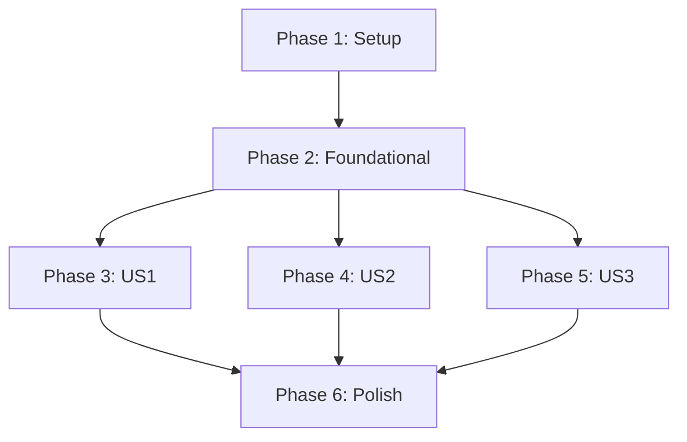

# Tasks: Visualizador de Reportes de SonarQube

**Feature Branch**: `001-sonarqube-report-viewer`  
**Feature**: SonarQube Report Visualizer  
**Generated**: 12 de febrero de 2026

---

## Overview

| Metric         | Value             |
| -------------- | ----------------- |
| Total Tasks    | 44                |
| User Stories   | 3                 |
| Parallelizable | 12                |
| MVP Scope      | User Story 1 (P1) |

---

## Phase 1: Setup (Project Initialization)

**Purpose**: Initialize project structure and dependencies

- [x] T001 Initialize Python project with uv in backend/ directory
- [x] T002 Create pyproject.toml with dependencies (FastAPI, SQLAlchemy, httpx, pydantic)
- [x] T003 Set up .env.example with SONARQUBE_URL and SONARQUBE_TOKEN placeholders
- [x] T004 Create directory structure per plan.md (backend/src, backend/tests, frontend/)
- [x] T005 Set up ruff and pytest configuration files
- [x] T006 Create .gitignore for Python and node_modules

---

## Phase 2: Foundational (Blocking Prerequisites)

**Purpose**: Core infrastructure required before any user story

- [x] T007 [P] Create database models in backend/src/models/ (Connection, Project, MetricsSnapshot, Issue)
- [x] T008 [P] Implement database session management in backend/src/db/session.py
- [x] T009 Create config.py for environment variable loading with Pydantic BaseSettings
- [x] T010 Implement health check endpoint GET /api/health in backend/src/main.py
- [x] T011 [P] Set up logging configuration per Constitution (structured logs, error context)
- [x] T012 Add error handling middleware in backend/src/main.py for consistent error responses

---

## Phase 3: User Story 1 - Conectar a SonarQube y visualizar métricas generales (P1)

**Goal**: Configure connection to SonarQube and view project metrics dashboard

**Independent Test**: User can configure credentials, select project, and see dashboard with Quality Gate, Coverage, Bugs, Vulnerabilities, Code Smells

### Implementation Tasks

- [x] T013 [P] [US1] Create SonarQube API client service in backend/src/services/sonar_client.py
- [x] T014 [P] [US1] Implement connection CRUD endpoints in backend/src/api/connections.py (GET/POST /api/connections)
- [x] T015 [P] [US1] Implement connection test endpoint POST /api/connections/{id}/test with Bearer auth
- [x] T016 [US1] Implement project sync from SonarQube in backend/src/services/sync_service.py
- [x] T017 [US1] Implement project listing endpoints in backend/src/api/projects.py
- [x] T018 [US1] Implement metrics fetch and storage in backend/src/services/metrics_service.py
- [x] T019 [US1] Create project detail endpoint GET /api/projects/{id} with current metrics
- [x] T020 [US1] Implement refresh endpoint POST /api/projects/{id}/refresh

### Tests

- [x] T021 [P] [US1] Write unit tests for sonar_client.py (mock SonarQube API responses)
- [x] T022 [P] [US1] Write unit tests for connections API endpoints
- [x] T023 [P] [US1] Write property-based tests for connection validation (URL, token formats)
- [x] T024 [US1] Write integration tests for full connection → sync → metrics flow

---

## Phase 4: User Story 2 - Ver detalles de Issues y Problemas (P2)

**Goal**: Explore specific issues with filtering by type and severity

**Independent Test**: User can navigate issues, filter by severity, view issue details (location, rule, suggestion)

### Implementation Tasks

- [x] T025 [P] [US2] Implement issues search endpoint GET /api/projects/{id}/issues in backend/src/api/issues.py
- [x] T026 [US2] Add filtering by type (BUG, VULNERABILITY, CODE_SMELL) and severity (BLOCKER, CRITICAL, MAJOR, MINOR, INFO)
- [x] T027 [US2] Implement pagination for issues endpoint
- [x] T028 [US2] Create issue detail endpoint GET /api/issues/{id}
- [x] T029 [US2] Add issue filtering UI in frontend/js/components/issue-list.js

### Tests

- [x] T030 [P] [US2] Write unit tests for issues filtering logic
- [x] T031 [P] [US2] Write PBT for issue severity/type validation

---

## Phase 5: User Story 3 - Visualizar historial y tendencias (P3)

**Goal**: View historical trends of quality metrics over time

**Independent Test**: User can select date range and see line charts for metrics evolution

### Implementation Tasks

- [x] T032 [P] [US3] Implement trends endpoint GET /api/projects/{id}/trends in backend/src/api/trends.py
- [x] T033 [US3] Add date range filtering (from, to parameters) for trends
- [x] T034 [US3] Create trend visualization component in frontend/js/charts.js using Chart.js
- [x] T035 [US3] Add trends page to frontend with date range picker

### Tests

- [x] T036 [US3] Write unit tests for trend data aggregation

---

## Phase 6: Polish & Cross-Cutting Concerns

**Purpose**: Final improvements and UI refinement

### Implementation Tasks

- [x] T037 [P] Add staleness indicator to project details (show when data is >24h old)
- [x] T038 Add loading states and skeleton UI in frontend
- [x] T039 Add empty states UI (no projects, no issues)
- [x] T040 Apply color palette per FR-007a (#FF4444, #FF8800, #FFCC00, #4488FF, #888888)
- [x] T041 Implement responsive design for tablet and mobile
- [x] T042 Add accessibility features (ARIA labels, keyboard navigation)
- [x] T043 Update README.md with quickstart and usage instructions
- [x] T044 Create CHANGELOG.md with initial version entry

---

## Dependencies & Execution Order



### Story Dependencies

| User Story | Depends On | Independent Testable     |
| ---------- | ---------- | ------------------------ |
| US1 (P1)   | Phase 1, 2 | ✅ Yes                   |
| US2 (P2)   | US1        | ⚠️ Partially (needs API) |
| US3 (P3)   | US1        | ⚠️ Partially (needs API) |

---

## Parallel Execution Examples

### Phase 2 Parallel Tasks

```bash
# These can run in parallel (different files, no dependencies)
uv run pytest tests/unit/test_models.py &
uv run pytest tests/unit/test_config.py &
wait
```

### Phase 3 Parallel Tasks

```bash
# API client and endpoints can be developed in parallel
uv run pytest tests/unit/test_sonar_client.py &
uv run pytest tests/unit/test_connections_api.py &
wait
```

---

## MVP Scope

**Minimum Viable Product**: User Story 1 only

To ship MVP, complete:

- Phase 1: T001-T006
- Phase 2: T007-T012
- Phase 3: T013-T024

This provides:

- Connection management to SonarQube
- Project listing and metrics dashboard
- Manual data refresh

**Estimated Timeline**: ~60% of total effort for MVP

---

## Implementation Strategy

### Incremental Delivery

1. **Sprint 1**: Setup + Foundation (T001-T012)
2. **Sprint 2**: MVP - Connection + Metrics (T013-T024)
3. **Sprint 3**: Issues Browser (T025-T031)
4. **Sprint 4**: Trends + Polish (T032-T044)

### Key Milestones

| Milestone | Tasks     | Deliverable          |
| --------- | --------- | -------------------- |
| M1        | T001-T006 | Project builds, runs |
| M2        | T007-T012 | API endpoints work   |
| M3        | T013-T024 | Full MVP (US1)       |
| M4        | T025-T031 | Issues feature       |
| M5        | T032-T044 | Complete feature     |

---

## Notes

- All tasks follow the checklist format: `[ ] [TaskID] [P?] [Story?] Description`
- [P] marker indicates task is parallelizable
- [US1], [US2], [US3] labels map to user stories from spec.md
- Tests are REQUIRED per Constitution (test-first approach)
- Property-Based Tests (PBT) required for validation logic
